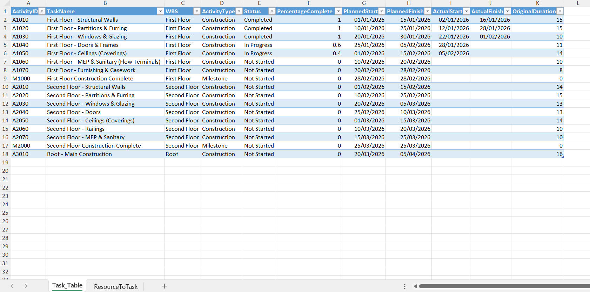
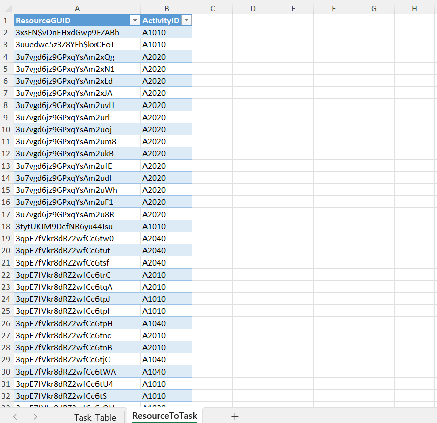

# Technical Documentation: 4D Construction Dashboard

<iframe title="ifcviewer_4D" style="width: 100%; aspect-ratio: 16 / 9;" src="https://app.powerbi.com/reportEmbed?reportId=fe804611-31ce-453a-94fd-bfd5debaaf1a&autoAuth=true&ctid=44b640f3-49b0-4304-9c98-c61d0bc0dc02" frameborder="0" allowFullScreen="true"></iframe>

## Executive Overview
The **4D Construction Dashboard** serves as a specialized **Digital Twin**, integrating Building Information Modeling (IFC Data) with Construction Scheduling and Management. By linking the physical model (**ifc**) directly to the project schedule, it provides stakeholders with a "time-machine" view of the project's progress.

This tool is essential for **Project Managers**, **Planners**, and **Site Engineers** to validate schedules, track delays, and visualize the sequence of work before execution.

---

## Input Data Requirements (Critical)

To ensure the dashboard functions correctly, the input data **MUST** follow a strict structure. The Power BI model relies on a specific Excel template linked via parameters.

### 1. Download the Template
Start by downloading the standard Excel template. **Do not rename the sheets inside this workbook.**

[Download 4D Planning Template](../_media/4D_Planning_Template.xlsx)

---

### 2. Sheet: Task_Table (The Schedule Source)
This is the primary dataset driving the Gantt chart and 4D simulation.
> **Important:** The sheet name must remain exactly **Task_Table**.

| Attribute Name | Data Type | Description & Usage |
| :--- | :--- | :--- |
| **ActivityID** | Text / Number | **Primary Key.** A unique identifier for each task. This ID is often used to link with the BIM Model (e.g., matching the **Mark** or **Tag** parameter in Revit). |
| **TaskName** | Text | A descriptive name for the activity (e.g., "Pouring L2 Slab"). Appears in the Gantt Chart. |
| **WBS** | Text | **Work Breakdown Structure.** Used to group tasks hierarchically (e.g., "First Floor > Structure"). |
| **Status** | Text | **Crucial for Coloring.** Valid values are: **Completed**, **In Progress**, **Not Started**. This field directly controls the 3D visualization colors. |
| **PercentageComplete** | Decimal | Represents progress (0.0 to 1.0). Used for earned value calculations. |
| **PlannedStart** | Date | The scheduled start date. **Must be a valid Date format.** |
| **PlannedFinish** | Date | The scheduled finish date. **Must be a valid Date format.** |
| **ActualStart** | Date | (Optional) Real-world start date for comparison logic. |
| **ActualFinish** | Date | (Optional) Real-world finish date. |
| **OriginalDuration** | Number | The planned duration in days. |

*Figure 1: Example of a correctly populated Task_Table.*

---

### 3. Sheet: ResourceToTask (Resource Allocation)
This sheet handles the resource allocation logic by linking specific resources to project activities.
> **Important:** The sheet name must remain exactly **ResourceToTask**.

| Attribute Name | Data Type | Description & Usage |
| :--- | :--- | :--- |
| **ResourceGUID** | Text | Unique ID for the resource (Labor, Material, Equipment). |
| **ActivityID** | Text | **Foreign Key.** This **MUST match** an **ActivityID** from the **Task_Table**. It creates the relationship between the resource and the schedule task. |

*Figure 2: Linking Resources to Activities.*

---

## Setup & Configuration Guide

### How to Link Your Data
The dashboard is designed to be dynamic. You don't need to edit the Power BI file structure; simply update the connection parameter.

1.  Open the Power BI Report (**.pbix**).
2.  Go to **Home** > **Transform Data** > **Edit Parameters**.
3.  Locate the parameter named **4D_Planning_Template**.
4.  Paste the full file path of your local Excel file.
    * *Example:* `C:\Users\Name\Projects\4D_Schedule.xlsx`
5.  Click **OK** and then **Apply Changes**.

### How to Update Progress
As the project moves forward, you only need to update the Excel file:
1.  Open your linked Excel Workbook.
2.  Update the **Status** column (e.g., change specific tasks from "In Progress" to "Completed").
3.  Update **PercentageComplete** and **Actual** dates if necessary.
4.  **Save** the Excel file.
5.  In Power BI (or the Web Viewer), click the **Refresh** button. The Dashboard, Gantt Chart, and 3D Coloring will update instantly.

---

## Technical Logic: Status & Coloring

The dashboard utilizes a **DAX Logic Matrix** to assign statuses dynamically based on the comparison between the **Timeline Date** (selected by the user) and the **Task Dates**.

| Visual Status | Color Code | Logic Condition |
| :--- | :--- | :--- |
| **Completed** | **Green** | Work that has been fully finished historically (**Task Finish Date < Selected Date**). |
| **In Progress** | **Yellow** | Work currently active on site (**Selected Date** is between **Start** and **Finish**). |
| **Not Started** | **Red / Transparent** | Future scope. Often rendered with high transparency to focus on active work. |
| **Delayed** | **Orange** | Tasks where **Planned Finish < Today** but **% Complete < 100%**. |