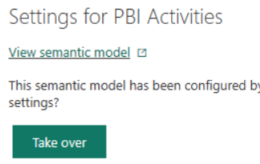
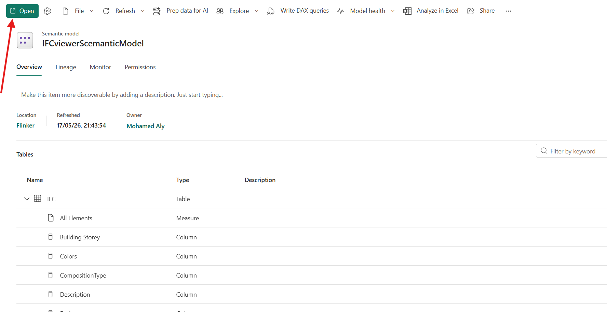
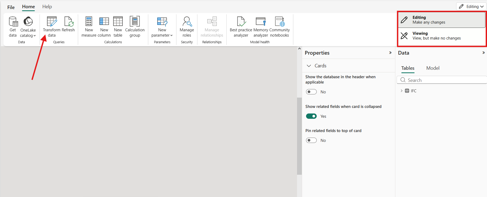
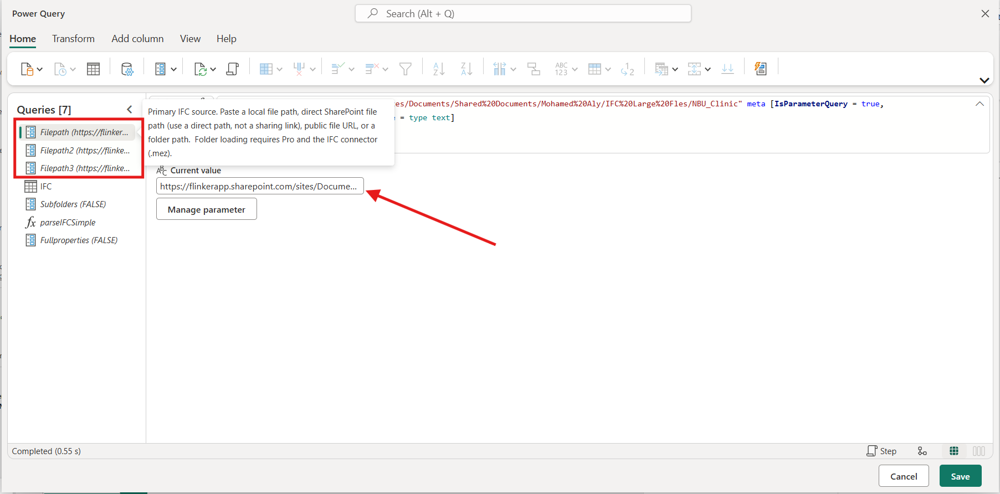
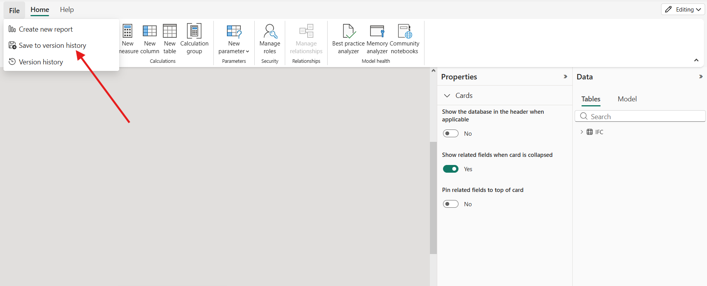
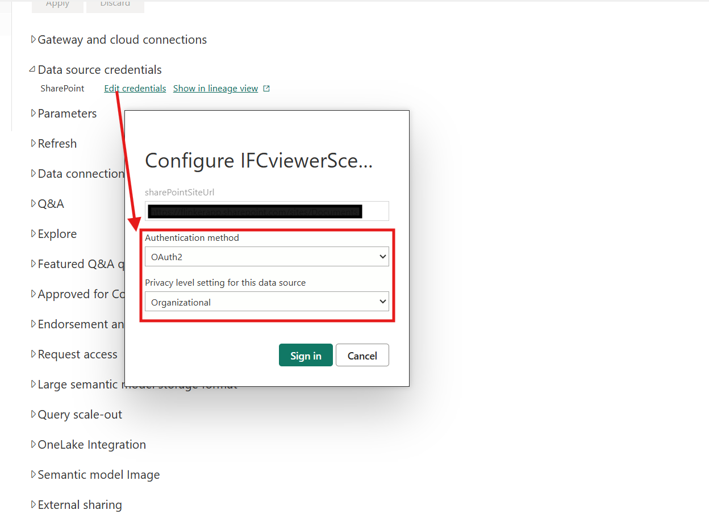
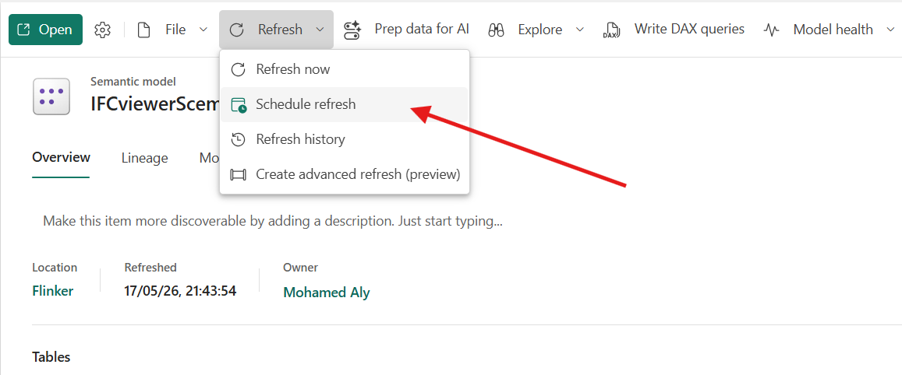
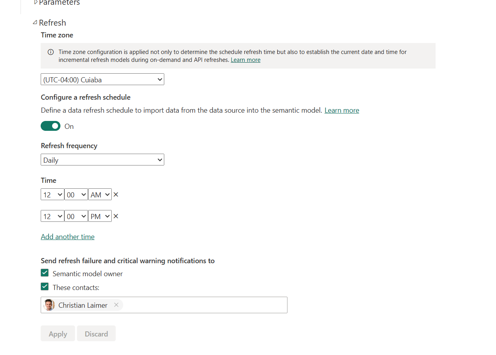

# IFC Cloud Semantic Model

## What does it mean?

The **IFC Cloud Semantic Model** is a Power BI dataset that:

1. Reads IFC models stored in your SharePoint
2. Parses them automatically in the cloud on a schedule
3. Acts as a single source of truth for multiple Power BI reports

In a typical setup, different teams in the same organization build separate reports on top of the same semantic model — for example one team for **model quality**, another for **quantities**, another for **project progress**, another for **cost**, and another for **carbon**. They all read from the same parsed IFC data, so the analysis stays consistent across teams.

For an end-to-end usage example of the underlying IFC multi-file pattern, see [IFC Multi-File Loading & Coloring Sample (Power BI)](IFC_Multi_File_Loading.md).

## Examples of its benefits

- **Automated IFC parsing in the cloud** — Power BI Service refreshes the model on a schedule. No Desktop session needed for routine refresh.
- **Single source of truth** — one model, parsed once, used by every report.
- **Team separation** — model quality, quantities, progress, cost, and carbon can live in different reports owned by different teams, while reading from the same data.
- **Consistent measures** — DAX and KPIs defined once behave the same across every report.

## Prerequisites

| Requirement | Notes |
|---|---|
| Power BI **Pro** license (or PPU / Premium capacity) | Required to publish and consume the semantic model |
| A Power BI **workspace** | A standard workspace in your tenant is fine |
| **IFC models on SharePoint** | Direct `.ifc` file URLs (one per file) |
| The Flinker IFC **`.pbix`** template | From the [Flinker IFC Viewer on Microsoft AppSource](https://marketplace.microsoft.com/en-us/product/power-bi-visuals/flinkergmbh1644589155747.ifc-viewer?src=docs&mktcmpid=ifc_power_pi) |
| **Power BI Desktop** | Used once for initial publish only |

## Initial publish (one-time)

This is a one-time step to get the model into your Power BI workspace. After this, all routine maintenance happens in Power BI Service.

1. Download the [Flinker IFC `.pbix` template](https://marketplace.microsoft.com/en-us/product/power-bi-visuals/flinkergmbh1644589155747.ifc-viewer?src=docs&mktcmpid=ifc_power_pi).
2. Open it in Power BI Desktop.
3. Click **Home → Transform data → Edit parameters**.
4. Paste your initial SharePoint URLs into `Filepath`, `Filepath2`, and `Filepath3`.
5. Click **Home → Publish → [Your workspace] → Select**.

The semantic model and a starter report now appear in your workspace.

## Maintaining the model in Power BI Service

Once published, you can update IFC source paths and refresh the model entirely from the browser. The following steps cover the full cycle from taking over the model to scheduling its daily refresh.

### Step 1 — Take over the semantic model

Navigate to **Workspaces → [Your workspace] → [Your semantic model] → ⋯ (More options) → Settings**.

Scroll to the top of the settings panel and click **Take over**.

Take over transfers ownership of the model to your account. From this point on, your credentials are what Power BI will use to refresh, and you can edit the model.

### Step 2 — Open the model in web modeling

Go to the semantic model **Overview** page. Click the **Open** button at the top left.

This launches the web-based modeling experience — a lightweight version of Power BI Desktop running directly in the browser.

### Step 3 — Switch to Editing mode and open Transform data

In the top right corner of the web modeling page, switch from **Viewing** to **Editing**. Then click **Transform data** in the toolbar.

This opens **Power Query Online**, where you can edit parameters, queries, and the data model — the same experience as Power BI Desktop.

### Step 4 — Edit the Filepath parameters

In Power Query Online, click each of the parameter queries on the left (`Filepath`, `Filepath2`, `Filepath3`).

For each one, paste the new SharePoint URL into the **Current value** field.

Use direct `.ifc` file URLs. Make sure each URL works in the browser when signed in with the same account you used to Take over. You can also use folder link and the model will read all IFC files inside.

### Step 5 — Save the changes

Click **Save** at the bottom right of Power Query Online to return to the modeling page. Then click **File → Save to version history**.

This persists your parameter changes to the semantic model.

### Step 6 — Configure data source credentials

If this is the first time the model has been refreshed under your account, you need to authenticate against the SharePoint data source.

Navigate to **Settings → Data source credentials → Edit credentials**.

In the dialog:

- **Authentication method:** `OAuth2`
- **Privacy level:** `Organizational`
- Click **Sign in** and authenticate with an account that has read access to the SharePoint IFC files

### Step 7 — Schedule the refresh

From the semantic model page, click **Refresh → Schedule refresh**.

In the **Refresh** section that opens:

1. Toggle **Configure a refresh schedule** to **On**.
2. Pick the correct **Time zone**.
3. Set **Refresh frequency** — Daily or Weekly on Pro; Daily is usually enough for IFC sources.
4. Add **Time** slots that match when your IFC files are typically updated.
5. Check **Send refresh failure notifications to** and add at least one address (the semantic model owner is added automatically).
6. Click **Apply**.

From this point on, Power BI Service parses your IFC files automatically on the schedule you defined. No Desktop session is needed.

## Building separate reports for different teams

Once the semantic model is set up, multiple teams can build reports independently — for example one for **model quality**, one for **quantities**, one for **project progress**, one for **cost**, one for **carbon**. Each report is a thin layer of visuals on top of the shared model.

**From Power BI Service:** click **Workspace → + New → Report → Pick a published semantic model → [Your IFC semantic model] → Create**.

**From Power BI Desktop:** click **Home → Get data → Power BI semantic models → [Your IFC semantic model] → Connect**. Build visuals and **Publish** the thin report to a workspace.

Anyone with **Build** permission on the semantic model can create new reports on top of it. The data is shared and consistent — when the model refreshes, every report reflects the new data automatically.

## Important notes

- **All reports share the same data.** Every thin report sees what the last refresh produced. Use Row-Level Security (RLS) if different audiences need different views.
- **Take over is shared, not a copy.** When you Take over, you own the same semantic model — you don't get a private copy. To get an independent model, publish the `.pbix` again under a different name.
- **Parameter changes are not live.** After editing parameters in Power Query Online and saving, click **Refresh now** if you need the change applied immediately. Otherwise wait for the next scheduled refresh.
- **Credentials follow the owner.** When ownership changes via Take over, the new owner must re-authenticate the SharePoint data source.
- **Automated update** The most powerful feature of this workflow is its ability to automatically update. Whenever an IFC file is replaced with a newer version or new IFC files are added to the SharePoint folder, these changes will be reflected in the next scheduled refresh. This means the report only needs to be created once, with no additional manual effort required, as the entire process is fully automated thereafter.
## Troubleshooting

| Symptom | Likely Cause | What to do |
|---|---|---|
| **Take over** button is missing or disabled | Insufficient permissions on the model or workspace | Ask the workspace admin for **Member/Contributor** on the workspace and **Build** on the semantic model |
| **Open** button is missing on the semantic model page | The model is configured to not allow web modeling, or your license tier doesn't permit it | Verify you have a Pro/PPU/Premium license and that the workspace allows web modeling |
| Refresh fails with **credentials error** after Take over | The SharePoint source still has the previous owner's credentials cached | Settings → Data source credentials → Edit credentials → re-authenticate as OAuth2 / Organizational |
| Refresh fails with **404 / file not found** | A `Filepath` parameter points to a SharePoint URL that doesn't exist or that the owner can't read | Open the URL in the browser while signed in as the model owner; if it fails there, the path is wrong or you don't have permission |
| Yellow warning: *"You can't schedule refresh for this semantic model…"* | The data source pattern is dynamic and Power BI Service can't introspect it for scheduled refresh | Open the model in Power Query Online and confirm sources use the `SharePoint.Files` connector, or `Web.Contents(baseUrl, [RelativePath = ...])` with a static base URL |
| Newly created thin report shows no data | The thin report is connected to the wrong model, or the model has not been refreshed since you changed parameters | Verify the connection in the report's data source settings, then trigger **Refresh now** on the model |
| Scheduled refresh runs much slower than Desktop refresh | The cloud reads IFC files over the network rather than from local disk | Expected for cloud refresh. Reduce file count, split very large IFC models, or schedule outside peak hours |
| Visuals break after a parameter change | The new IFC files have a different structure (missing property sets, different classifications) | Verify the new IFC files match the schema expected by the model |

## Related

- [IFC Multi-File Loading & Coloring Sample (Power BI)](IFC_Multi_File_Loading.md)
- [Flinker IFC Viewer on Microsoft AppSource](https://marketplace.microsoft.com/en-us/product/power-bi-visuals/flinkergmbh1644589155747.ifc-viewer?src=docs&mktcmpid=ifc_power_pi)
experience=power-bi)