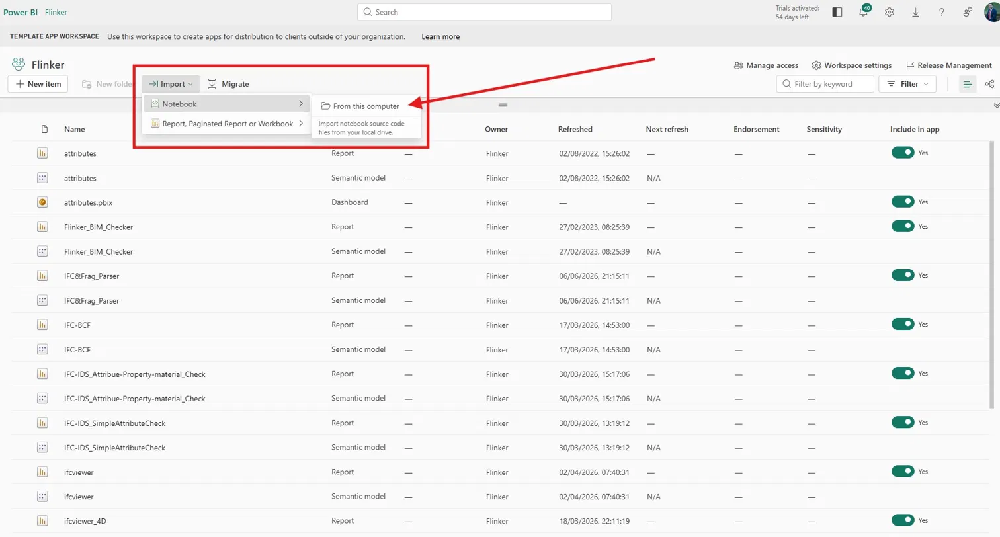
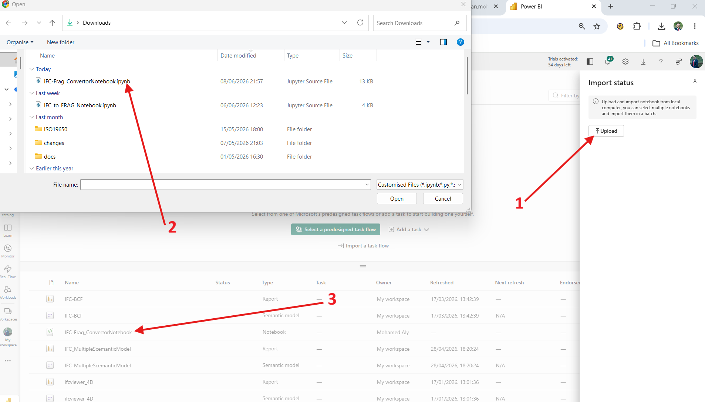
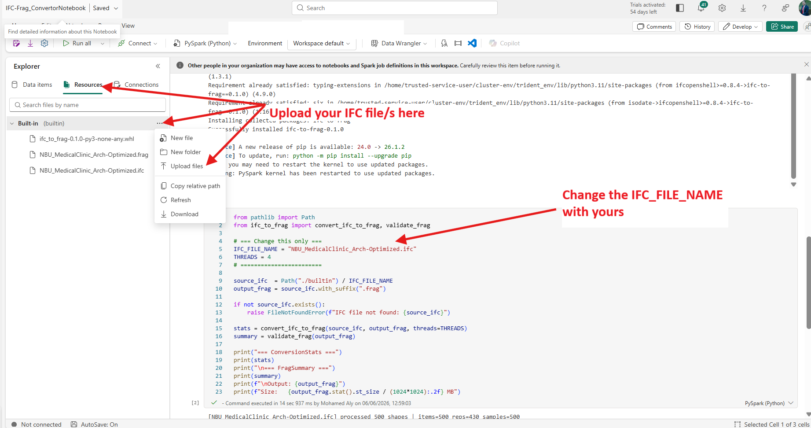

# Speed up large IFC models in Power BI

Large IFC files slow Power BI reports down. A 200 to 300 MB model can take minutes to render, and anything heavier often stalls the viewer entirely. This page shows the workflow we use at Flinker to keep large models loading instantly: convert the IFC into a compact `.frag` file once inside a Microsoft Fabric notebook, then reuse that `.frag` in every Power BI report.

## Try the live report

The report below loads three real models that started life as heavy IFC files. Click any element to inspect it, switch between models with the Filename slicer, and notice how fast the navigation feels even with 12,000 plus elements in view.

<iframe title="IFC&Frag_Parser" width="100%" height="540" src="https://app.powerbi.com/view?r=eyJrIjoiMzNlYmQ1MTktYWRjMC00ZTRjLTg1NjAtMTQ4ZTg5YjE3NWY3IiwidCI6IjQ0YjY0MGYzLTQ5YjAtNDMwNC05Yzk4LWM2MWQwYmMwZGMwMiJ9" frameborder="0" allowFullScreen="true"></iframe>

The three models loaded in the report are public test datasets we used to validate the workflow end to end:

| Model | Source IFC size | Optimized `.frag` size | Element count |
|------|----------------|-----------------------|---------------|
| LTU A-House – Air | 24.2 MB | 7.67 MB | 17,000 |
| LTU A-House – Cooling | 30.8 MB | 16.6 MB | 21,000 |
| LTU A-House – Ducting | 7.99 MB | 4.12 MB | 4,068 |
| LTU A-House – Heating | 32.6 MB | 12.7 MB | 23,000 |
| LTU A-House – K-modell | 30.9 MB | 3.23 MB | 6,667 |
| LTU A-House – Redesign | 173 MB | 24.0 MB | 9,714 |
| LTU A-House – Sanitation | 25.7 MB | 11.5 MB | 18,000 |
| LTU A-House – Voids | 24.1 MB | 7.68 MB | 17,000 |

On average a 200 to 300 MB IFC becomes a `.frag` of around 10 MB, roughly a 20 to 25 times reduction. The Power BI IFC Viewer then renders the `.frag` in seconds rather than the minutes the original IFC would take.

## Why this matters

Large IFC models (100 MB to multi‑GB) could be slow to load and interact with in Power BI due to their complex geometry and rich metadata. This solution addresses that limitation by transforming heavy IFC data into a highly optimized, geometry-first format that dramatically improves rendering performance and usability. In testing, models in the 100–300 MB range typically load 5× to 20× faster and are reduced to 10×–30× smaller file sizes, enabling smooth navigation inside the Power BI viewer. While this workflow is highly effective for large models, practical limits depend on available memory and compute in Microsoft Fabric; models up to several hundred MB are reliably handled, while multi-GB models (e.g. 5 GB+) require partitioning or preprocessing to ensure stability. This makes the approach ideal for high-performance visualization scenarios.

## How the conversion works

The conversion runs in a Microsoft Fabric notebook using a small Python wheel built around [That Open Fragments](https://github.com/ThatOpen/engine_fragment) and [IfcOpenShell](https://ifcopenshell.org/). Two cells do the work:

1. Install the converter wheel.
2. Call `convert_ifc_to_frag(source_ifc, output_frag)` and validate the result.

The output `.frag` sits next to the IFC in the same folder. Point any Power BI IFC Viewer template at that file and the report is ready.

## Set up the converter in Fabric

### Method 1: Import the ready-made notebook

The fastest path is to import the provided `.ipynb` straight into your workspace.

In your Fabric workspace, open the **Import status** panel and click **Upload**. Select the `IFC-Frag_ConvertorNotebook.ipynb` file from your local drive. Once uploaded, the notebook appears in your workspace items list. *Figure 1* shows the sequence: click **Upload** (arrow 1), pick the `.ipynb` file (arrow 2), and confirm it appears in the workspace items list (arrow 3).



*Figure 1: Notebook upload workflow.*

If the Import status panel is not visible, open it from the workspace toolbar via **Import**, then **Notebook**, then **From this computer**, as shown in *Figure 2*.



*Figure 2: Workspace toolbar Import menu navigation.*

Open the imported notebook and switch to the **Resources** tab on the left. Under **Built-in**, click the **...** menu and choose **Upload files**. Upload:

* `ifc_to_frag-0.1.0-py3-none-any.whl` (the converter package, required once per notebook).
* Your IFC source file (for example `NBU_MedicalClinic_Arch-Optimized.ifc`).

Then edit the `IFC_FILE_NAME` parameter in the second code cell so it matches the name of the IFC file you just uploaded.



*Figure 3: Built-in resources panel (left) and the IFC_FILE_NAME parameter (right). Both the converter wheel and the IFC source must be present in `./builtin/` before running the notebook.*

Click **Run all**. The notebook installs dependencies, converts the IFC, validates the output, and prints both `ConversionStats` and `FragSummary`. The generated `.frag` file appears next to the source IFC inside `./builtin/`, with the same base name and a `.frag` extension.

### Method 2: Create a notebook from scratch

If you would rather embed the conversion inside an existing pipeline, the two cells below are all you need.

Create a new notebook in your Fabric workspace and upload `ifc_to_frag-0.1.0-py3-none-any.whl` and the IFC source to **Resources > Built-in** as shown in *Figure 3* above.

Paste this into the first code cell:

```python
%pip install "flatbuffers>=25.12.0" "ifcopenshell>=0.8.4" "numpy>=2.2.0"
%pip install "./builtin/ifc_to_frag-0.1.0-py3-none-any.whl"
```

Then paste this into the second code cell and update `IFC_FILE_NAME` to match your uploaded IFC:

```python
from pathlib import Path
from ifc_to_frag import convert_ifc_to_frag, validate_frag

# === Change this only ===
IFC_FILE_NAME = "YourModel.ifc"
THREADS = 4
# ========================

source_ifc  = Path("./builtin") / IFC_FILE_NAME
output_frag = source_ifc.with_suffix(".frag")

if not source_ifc.exists():
    raise FileNotFoundError(f"IFC file not found: {source_ifc}")

stats = convert_ifc_to_frag(source_ifc, output_frag, threads=THREADS)
summary = validate_frag(output_frag)

print("=== ConversionStats ===")
print(stats)
print("\n=== FragSummary ===")
print(summary)
print(f"\nOutput: {output_frag}")
print(f"Size:   {output_frag.stat().st_size / (1024*1024):.2f} MB")
```

Click **Run all**. The generated `.frag` lands inside `./builtin/`.

> **Built-in resources size limits:** A single file uploaded to a notebook's Built-in resources is capped at **100 MB**, with **500 MB** total. For IFC files larger than 100 MB, store the source inside a Lakehouse `Files/` folder and update `source_ifc` accordingly.

## Load the `.frag` in the Power BI IFC Viewer

The Power BI IFC Viewer template supports `.frag` files via the same `Filepath` parameter used for `.ifc` files. Paste the full path of the generated `.frag` into the `Filepath` parameter and click **Refresh**. The viewer renders the model.

Loading a `.frag` and an `.ifc` together in the same report works because the parsers produce identical column schemas, so the resulting model table mixes both sources cleanly. For a full walkthrough of the parameter and slicer setup, see [Build reports with the IFC Viewer](https://docs.flinker.app/docs/ifc-viewer-usage-for-power-bi.html).

## When to use `.frag` and when to keep `.ifc`

Use `.frag` whenever the dashboard is primarily about visualization: 3D navigation, element selection, GUID-based highlighting, BCF integration. Slicers on `Entity`, `GlobalId`, and `ExpressId` work normally because those columns come from the `.frag` itself.

Keep `.ifc` when the dashboard depends on attribute-driven slicers such as `Name`, `Building Storey`, `Room Name`, or `PredefinedType`. The current `.frag` format stores geometry and identity only, so those textual columns are empty on `.frag` rows. A companion workflow that extracts attributes into a separate Parquet file is available for reports that need both: the live report above demonstrates how the two sources combine.
