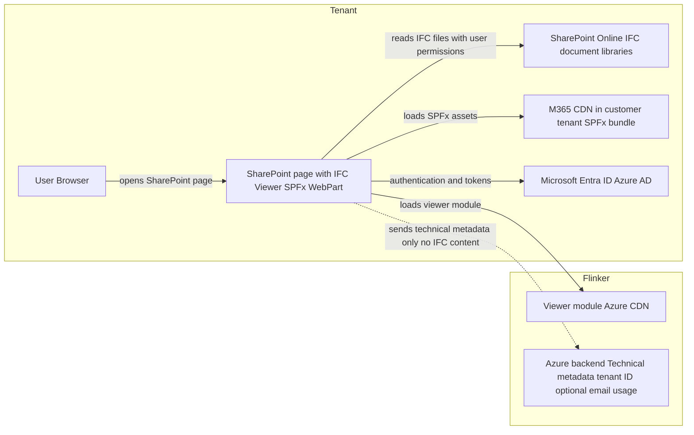

# IFC Viewer for SharePoint – Architecture and Data Protection

_Last updated: December 2025_

The **Flinker IFC Viewer for SharePoint** is implemented as a **SharePoint Framework (SPFx) WebPart** and (optionally) as a Teams tab host. It is operated entirely within the customer’s Microsoft 365 tenant and is designed so that all IFC and project data remain in the tenant at all times.

This page provides an app-specific view for IT security teams.

## Product-specific Privacy Highlights

- All IFC files, BIM data, and project documents remain 100% inside your Microsoft 365 tenant.
- Flinker never receives or stores IFC model content, plans, drawings, or other project documents.
- The SPFx bundle is stored in the customer’s M365 CDN; the viewer module is loaded from Flinker’s Azure CDN as static code only, without customer data.
- The WebPart does not access mailbox items or Teams chat messages.
- No external non-Microsoft business systems or APIs are used; only Microsoft 365 services (SharePoint, optional Teams, Entra ID).
- Only strictly limited technical metadata (tenant ID, optional e-mail address, anonymised usage metrics) are sent to the Flinker Azure backend, as described in [section 4](#4-transmission-of-technical-metadata-to-flinker).

## 1. Integration and Operating Model

- The app is deployed as an SPFx solution into the customer’s **SharePoint Online** environment.
- Users add the **“IFC Viewer” WebPart** to SharePoint pages in sites where IFC files are stored.
- The SPFx bundle itself is stored in the **Microsoft 365 CDN** of the customer’s tenant; at runtime, an additional viewer module is loaded from Flinker’s Azure CDN.
- The same component can also host a **Teams tab** (`supportedHosts: ["SharePointWebPart","TeamsTab"]`), but this document focuses on the SharePoint use case.

All installation and access remain under the security and governance controls of the customer’s Microsoft 365 tenant.

## 2. Components and Data Flows

**Components**

- **User / Browser**
  - Accesses a SharePoint page containing the IFC Viewer WebPart.
- **SharePoint Online (customer tenant)**
  - Stores the IFC model files in document libraries.
  - Hosts the SPFx solution and WebPart configuration.
- **Microsoft Entra ID (Azure AD)**
  - Authenticates users and enforces permissions.
- **IFC Viewer SPFx WebPart**
  - Runs client-side in the browser and renders the IFC model on the SharePoint page.
- **Flinker Azure CDN**
  - Delivers the viewer module and static assets (JavaScript, rendering libraries).
- **Flinker Azure Backend**
  - Receives strictly limited technical metadata (see section 4); no IFC content or project documents.

**Data flows**

1. The user opens a SharePoint page; SharePoint loads the **IFC Viewer WebPart** and associated SPFx assets from the **M365 CDN** in the customer’s tenant.
2. The WebPart loads the viewer module from the **Flinker Azure CDN**. Only static program code is delivered; no IFC data is sent to Flinker via the CDN.
3. Using the user’s SharePoint permissions, the WebPart reads IFC files directly from the relevant document library in the customer’s tenant.
4. The IFC model is parsed and visualised **entirely in the user’s browser**; no model content is transmitted to Flinker.
5. Separately from the IFC contents, the WebPart may send **technical metadata** (Tenant ID, optional e-mail, anonymised usage metrics) to the Flinker Azure backend (see section 4).

### Architecture Diagram

Diagram summarising tenant-resident components and client-side data flows for the IFC Viewer SPFx WebPart and its Azure CDN module.

## 3. Processing and Protection of Sensitive Data

- **All IFC and business data remain in the Microsoft 365 tenant of the customer**
  - IFC models, BIM data, drawings, plans, and all related project documents are stored and processed only in SharePoint Online.
  - No contents of these files (geometries, property sets, component data, annotations, versions, etc.) are transferred outside Microsoft 365 or stored on external servers.
- **No external system for project data**
  - The app is designed so that no external service can access or retrieve project documents from SharePoint.
- **Execution as SPFx WebPart**
  - The viewer runs as a client-side WebPart in the browser, with **no local installation** and **no additional custom script** permissions (requiresCustomScript = false).
- **Secure transmission**
  - All communication uses TLS/HTTPS.  
  - Underlying Microsoft datacentres for EU tenants are located in the EU.

The complete data sovereignty over IFC and project data always remains with the customer.

## 4. Transmission of Technical Metadata to Flinker

Consistent with the general IFC Viewer architecture, only a minimal set of **technical metadata** is transmitted from the SPFx WebPart to the Flinker Azure backend to support secure operation and anonymised usage analytics.

**Transmitted metadata**

- Tenant ID (for unique tenant identification)
- (Optional) User e-mail address (only if required for login/support)
- Anonymised usage and analytics data, e.g.:
  - function usage counters,
  - non-content related performance metrics.

**Not transmitted**

- No IFC file contents or subsets (geometry, properties, component structures, etc.).
- No SharePoint documents or list items.
- No project-specific business data.

All metadata is pseudonymised and encrypted; access on Flinker side is restricted to selected authorised staff in the EU and is processed in accordance with GDPR and, where required, on the basis of a Data Processing Agreement.

## 5. SPFx Manifest and Supported Hosts

The SPFx manifest defines the component as:

- `"componentType": "WebPart"` with alias `"SharePointViewerWebPart"`.  
- `"supportedHosts": ["SharePointWebPart", "TeamsTab"]` – meaning the same component can be used both on SharePoint pages and as a tab in Teams.
- `"requiresCustomScript": false` – no arbitrary script injection and no additional scripting permissions are required.

This aligns with Microsoft’s SPFx security model and ensures that standard tenant governance mechanisms (Entra ID, SharePoint permissions, Conditional Access, etc.) remain fully effective.

## 6. Summary for IT and Compliance

- The IFC Viewer for SharePoint is an SPFx WebPart operating entirely within the customer’s Microsoft 365 tenant.
- All IFC and project data are processed and stored exclusively in SharePoint Online; no business data is transferred to Flinker or third parties.
- The WebPart loads viewer code from Flinker’s Azure CDN, but no IFC content is exchanged with this CDN.
- Only limited technical metadata (Tenant ID, optional e-mail, anonymised usage metrics) is transmitted to the Flinker Azure backend.
- All processing follows GDPR and can be covered by a Data Processing Agreement (AVV) where required.

For additional technical documentation or security workshops with your IT department, please contact **support@flinker.app**.

## 7. Microsoft Compliance & Security

- The app is certified and reviewed by Microsoft before publication in AppSource.
- All security and privacy measures follow Microsoft’s own guidelines for SharePoint apps and tenant-only integrations.
- For more on Flinker’s continuous security and compliance updates, see  
  [General Architecture & Data Protection](https://docs.flinker.app/docs/ifc-viewer-architecture-and-data-protection.html).

## More Information / Contact

For technical documentation, a list of transmitted metadata, or to schedule a compliance call:

Flinker GmbH  
support@flinker.app  
[www.flinker.app](https://www.flinker.app)

_For all company-wide privacy and data protection details, visit our  
[General Architecture & Data Protection](https://docs.flinker.app/docs/ifc-viewer-architecture-and-data-protection.html) page._

