> [!TIP]  
> Why Choose Our SharePoint and Teams Access Control Tool?  
> - **Clear Access Reports**: Instantly see who can access, edit, or share your files for total control.  
> - **Bulk Edits**: Save time by adjusting access settings across teams and folders quickly.  
> - **Secure External Collaboration**: Grant safe access to external users without compromising security.  

> [!Note]
> - 🛡️ **Privacy First: Your Data Stays With You!** No files or data are transferred or uploaded anywhere. All permission management is handled directly within SharePoint, ensuring full privacy and security.
> - 🚨 **App must be installed by a SharePoint administrator!**

# Share App Installation

This guide provides detailed steps for installing the Share App.

```mermaid
flowchart LR
    subgraph SearchApp[Search App]
      style SearchApp fill:transparent,stroke:transparent,rounded
      A((🔍))
      style A fill:#f0f0f0,stroke:#f0f0f0,stroke-width:1px,rounded
    end

      subgraph AdminApproval[<br>Add App]
        style AdminApproval fill:transparent,stroke:transparent,rounded
        C{🚨}
        style C fill:#f0f0f0,stroke:#f0f0f0,stroke-width:1px,rounded
      end

      subgraph EnableAdd[Add To All Sites]
        style EnableAdd fill:transparent,stroke:transparent,rounded
        D((🌐🌐🌐))
        style D fill:#f0f0f0,stroke:#f0f0f0,stroke-width:1px,rounded
      end

      subgraph OnlyEnable[Only Enable]
        style OnlyEnable fill:transparent,stroke:transparent,rounded
        E((🔓))
        style E fill:#f0f0f0,stroke:#f0f0f0,stroke-width:1px,rounded
      end

        subgraph ManualAdd[Add To Specific Site]
        style ManualAdd fill:transparent,stroke:transparent,rounded
        F((🌐))
        style F fill:#f0f0f0,stroke:#f0f0f0,stroke-width:1px,rounded
        end

    subgraph ManagePermissions[Use App]
      style ManagePermissions fill:transparent,stroke:transparent,rounded
      G((✅))
      style G fill:#f0f0f0,stroke:#f0f0f0,stroke-width:1px,rounded
    end

    A --> C
    C --> D
    C --> E
    D --> G
    E --> F
    F --> G
```

## 1. Add Share App from the App Catalog or AppSource

You can add the Share App to your site directly through the App Catalog or AppSource link.

### Option 1: From AppSource

1. Visit the [AppSource link](https://appsource.microsoft.com/en-us/product/office/WA200007197?src=docs&mktcmpid=docs_installation).
2. Click on "Get it now" to proceed with adding the Share App to your environment.

### Option 2: From the App Catalog

1. Go to your App Catalog site: `https://yourdomain.sharepoint.com/sites/appcatalog/_layouts/15/appStore.aspx/appDetail/WA200007197`. Replace `yourdomain` with your specific domain.

## 2. Add the Share App

1.  Click on "Add to Apps site" to start the installation process.

2. Now you have two options:
    - Click "Enable and Add" to both approve and add the app to all sites automatically.
    - Click "Only Enable" to enable the app without adding it automatically.

### If You Clicked "Only Enable"

1. The admin or site owner needs to manually add the app to a specifc site.
2. Go to the site where you want to add the app.
3. Navigate to "My apps" and select "Share App".
4. Click on "Add" to add the Share App to the site.

## 3. Manage Permissions for the Share App

1. Navigate to the document library where your content is stored.
2. Select the folder or file for which you want to manage permissions.
3. Click on the three dots (**...**) next to the selected item to open the context menu.
4. Choose **Manage permissions** from the dropdown menu.
5. Adjust the permissions as needed for users or groups.
