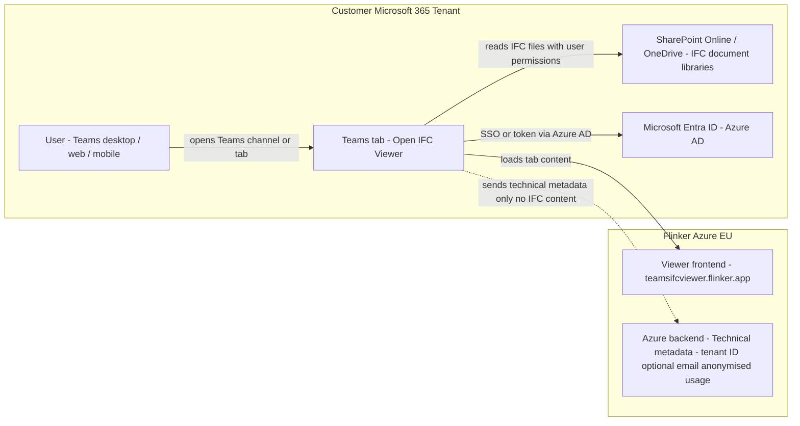

# Open IFC Viewer for Microsoft Teams – Architecture and Data Protection

_Last updated: December 2025_

The **Open IFC Viewer for Microsoft Teams** is a tab app that runs inside the customer’s Microsoft 365 tenant. It is designed so that all IFC and project data remain under the control of the customer’s tenant at all times.

This page describes the architecture, data flows, and data protection measures for IT security and compliance teams.

## Product-specific Privacy Highlights

- All IFC files, BIM data, and project documents remain 100% inside your Microsoft 365 tenant.
- Flinker never receives or stores IFC model content, plans, drawings, or other project documents.
- Viewer code is delivered from Flinker (web endpoint / Azure CDN) as static assets only; no customer data is transferred via these endpoints.
- The app does not read or send Teams messages and does not access mailbox items.
- No external non-Microsoft business systems or APIs are used; only Microsoft 365 services (Teams, SharePoint, OneDrive, Entra ID).
- Only strictly limited technical metadata (tenant ID, optional e-mail address, anonymised usage metrics) are sent to the Flinker Azure backend, as described in [section 4](#4-transmission-of-technical-metadata-to-flinker).

## 1. Integration and Operating Model

- The app is installed from **Microsoft AppSource / Teams Store** into the customer’s **Microsoft 365 tenant**.
- Users add the app as a **Teams tab** in a team or group chat.
- IFC model files are stored in the customer’s existing **SharePoint Online / OneDrive** locations.
- The viewer runs in the user’s browser inside the Teams client and accesses only those IFC files to which the signed-in user already has permissions.

No separate Flinker tenant is created. All access and governance are controlled entirely by the customer’s Microsoft 365 environment.

## 2. Components and Data Flows

**Main components**

- **User / Teams Client**  
  - Microsoft Teams desktop, web, or mobile client.
- **Teams Tab “Open IFC Viewer”**  
  - Configurable tab defined in the app manifest (`configurableTabs`).  
  - Loads the viewer UI as a web application inside Teams.
- **SharePoint Online / OneDrive (customer tenant)**  
  - Stores the IFC model files in document libraries.
- **Microsoft Entra ID (Azure AD)**  
  - Handles authentication and authorization.
- **Flinker Azure Cloud**  
  - Provides:
    - a web endpoint to deliver the **viewer frontend** (HTML/JavaScript/CSS),
    - a **backend service** that receives strictly limited technical metadata (see section 4).
- **Azure CDN (Flinker)**  
  - Delivers static viewer assets (JavaScript/3D libraries). No IFC or project data is transmitted via the CDN.

**Data flows (high-level)**

1. The user opens a Teams channel or chat and selects the **Open IFC Viewer** tab.
2. Teams loads the tab configuration and requests the viewer page from Flinker (domain listed as `teamsifcviewer.flinker.app` in the manifest).
3. The viewer frontend (JavaScript) runs in the browser and, using the user’s existing Microsoft 365 identity, reads the configured IFC files from **SharePoint Online / OneDrive** in the same tenant.
4. The IFC model is parsed and rendered **entirely client-side in the browser** – no IFC content is sent to Flinker servers.
5. Independently of the IFC file contents, the app may send **technical metadata** to the Flinker Azure backend (see section 4).

At no point are IFC files or project documents transmitted outside the customer’s Microsoft 365 tenant.

### Architecture Diagram

Overview of the components in the customer tenant and how the tab loads and renders IFC models.

## 3. Processing and Protection of Sensitive Data

The Open IFC Viewer for Microsoft Teams is built with a privacy-first design:

- **100% of IFC and project content stays in the customer’s tenant**
  - IFC models, BIM data, plans, drawings, and all related project documents are stored and processed only in **SharePoint Online / OneDrive** within the tenant.
  - Flinker cannot access, download, or store these files. No geometries, property sets, or domain-specific project data are transmitted to Flinker.
- **Viewer execution in the browser**
  - IFC parsing and visualization are executed in the user’s browser as part of the Teams tab.
  - No local installation on the client machine is required.
- **No external systems for business data**
  - Only standard Microsoft 365 services (Teams, SharePoint, OneDrive, Entra ID) are used.  
  - There is no external SaaS database for project data; the app is designed so that no external system can access stored project documents.

All transmissions inside Microsoft 365 and between client and Flinker endpoints are protected using TLS/HTTPS.

## 4. Transmission of Technical Metadata to Flinker

To support secure operation and anonymous usage analytics, the app may transmit **technical metadata only** to the Flinker Azure backend. This applies also to the Teams app and is aligned with the general IFC Viewer documentation.

**Types of metadata**

- **Tenant ID** (GUID)  
  - Used to uniquely identify the Microsoft 365 tenant and manage licensing.
- **(Optional) User e-mail address**  
  - Only if required for login, support, or license assignment.
- **Anonymised usage and analytics data**, for example:
  - feature usage counters,
  - non-content related performance metrics.

**Not transmitted**

- No IFC file contents or subsets of model data (geometries, properties, components, etc.).
- No project documents, plans, drawings, or BIM attributes.
- No Teams chat messages or mailbox contents.

All transmitted metadata is pseudonymised where possible, encrypted in transit and at rest, and accessible only to a small group of authorised Flinker staff in the EU. Processing is performed in line with GDPR and, where applicable, under a Data Processing Agreement (DPA).

## 5. App Manifest, Permissions and Domains

The Teams app manifest defines:

- **Configurable tab**
  - `configurableTabs` with `scopes: ["team", "groupchat"]` – the app is used exclusively as a tab in Teams.
- **Permissions**
  - `"identity"` – used for sign-in and SSO with Microsoft 365.
  - `"messageTeamMembers"` – permission declared in the manifest. The Open IFC Viewer does **not** use this permission to read or send Teams messages and does not access mailbox items; it is technically limited to rendering IFC models in the tab UI.

- **Valid domain**
  - `teamsifcviewer.flinker.app` – the only external domain used by the app for loading viewer resources.

The generic permission texts shown in AppSource (“can send data over the internet”, “can access personal information in the active message”) are Microsoft standard texts and do **not** reflect actual access to Teams messages or project content in this app.

## 6. Summary for IT and Compliance

- All IFC and project data remain entirely within the customer’s Microsoft 365 tenant.
- The Teams app runs as a tab and accesses only IFC files in SharePoint/OneDrive using the user’s existing permissions.
- Flinker does **not** receive or store any IFC model contents or project documents.
- Only strictly limited technical metadata (Tenant ID, optional e-mail, anonymised usage metrics) is transmitted to Flinker’s Azure backend.
- The app has been reviewed and approved by Microsoft as part of the AppSource / Teams Store submission process.

For further details or security reviews, please contact: **support@flinker.app**.

## 7. Microsoft Compliance & Security

- The app is certified and reviewed by Microsoft before publication in AppSource and Teams Store.
- All security and privacy measures follow Microsoft’s own guidelines for Teams apps and tenant-only integrations.
- For more on Flinker’s continuous security and compliance updates, see  
  [General Architecture & Data Protection](https://docs.flinker.app/docs/ifc-viewer-architecture-and-data-protection.html).

## More Information / Contact

For technical documentation, a list of transmitted metadata, or to schedule a compliance call:

Flinker GmbH  
support@flinker.app  
[www.flinker.app](https://www.flinker.app)

_For all company-wide privacy and data protection details, visit our  
[General Architecture & Data Protection](https://docs.flinker.app/docs/ifc-viewer-architecture-and-data-protection.html) page._

