> [!TIP]  
> Why Choose the IFC Viewer for SharePoint?
> - **Integrated Experience**: View and interact with 3D IFC models directly in SharePoint Pages and Document Libraries.  
> - **Enhanced Collaboration**: Facilitate real-time teamwork among architects, engineers, and managers.  
> - **Data Privacy and Security**: Ensures your files stay within Microsoft 365.  

> [!Note]
> - 🛡️ **Privacy First: Your Data Stays With You!** We do not upload your files anywhere. All processing is client-side, ensuring full privacy and security.
> - 🚨 **App must be installed by a SharePoint administrator!**

# IFC Viewer Installation

This guide provides detailed steps for installing the IFC Viewer.

```mermaid
flowchart LR
    subgraph SearchApp[Search App]
      style SearchApp fill:transparent,stroke:transparent,rounded
      A((🔍))
      style A fill:#f0f0f0,stroke:#f0f0f0,stroke-width:1px,rounded
    end

      subgraph AdminApproval[<br>Add App]
        style AdminApproval fill:transparent,stroke:transparent,rounded
        C{🚨}
        style C fill:#f0f0f0,stroke:#f0f0f0,stroke-width:1px,rounded
      end

      subgraph EnableAdd[Add To All Sites]
        style EnableAdd fill:transparent,stroke:transparent,rounded
        D((🌐🌐🌐))
        style D fill:#f0f0f0,stroke:#f0f0f0,stroke-width:1px,rounded
      end

      subgraph OnlyEnable[Only Enable]
        style OnlyEnable fill:transparent,stroke:transparent,rounded
        E((🔓))
        style E fill:#f0f0f0,stroke:#f0f0f0,stroke-width:1px,rounded
      end

        subgraph ManualAdd[Add To Specific Site]
        style ManualAdd fill:transparent,stroke:transparent,rounded
        F((🌐))
        style F fill:#f0f0f0,stroke:#f0f0f0,stroke-width:1px,rounded
        end

    subgraph ManagePermissions[Use App]
      style ManagePermissions fill:transparent,stroke:transparent,rounded
      G((✅))
      style G fill:#f0f0f0,stroke:#f0f0f0,stroke-width:1px,rounded
    end

    A --> C
    C --> D
    C --> E
    D --> G
    E --> F
    F --> G
```

## 1. Add IFC Viewer from the App Catalog or AppSource

You can add the IFC Viewer to your site directly through the App Catalog or AppSource link.

### Option 1: From AppSource

1. Visit the [AppSource link](https://appsource.microsoft.com/en-us/product/office/WA200006238?src=docs&mktcmpid=docs_installation).
2. Click on "Get it now" to proceed with adding the IFC Viewer to your environment.

### Option 2: From the App Catalog

1. Go to your App Catalog site: `https://yourdomain.sharepoint.com/sites/appcatalog/_layouts/15/appStore.aspx/appDetail/WA200006238`. Replace `yourdomain` with your specific domain.

## 2. Add the IFC Viewer

1.  Click on "Add to Apps site" to start the installation process.

2. Now you have two options:
    - Click "Enable and Add" to both approve and add the app to all sites automatically.
    - Click "Only Enable" to enable the app without adding it automatically.

### If You Clicked "Only Enable"

1. The admin or site owner needs to manually add the app to a specifc site.
2. Go to the site where you want to add the app.
3. Navigate to "My apps" and select "IFC Viewer".
4. Click on "Add" to add the IFC Viewer to the site.

## 3. Use IFC Viewer to Open an IFC File

1. Navigate to the document library where your IFC files are stored.
2. Select the IFC file you want to open.

3. Click on the IFC file to view it using the IFC Viewer.

Congratulations! You have successfully installed and started using the IFC Viewer app in SharePoint.
